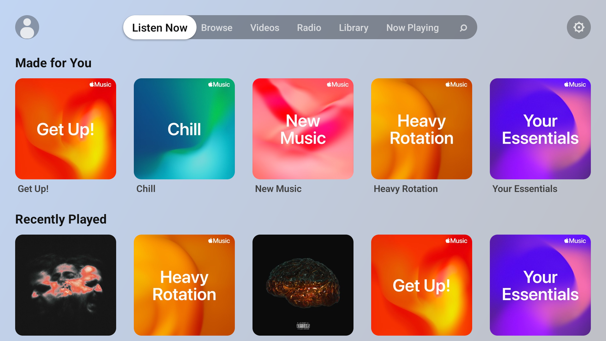
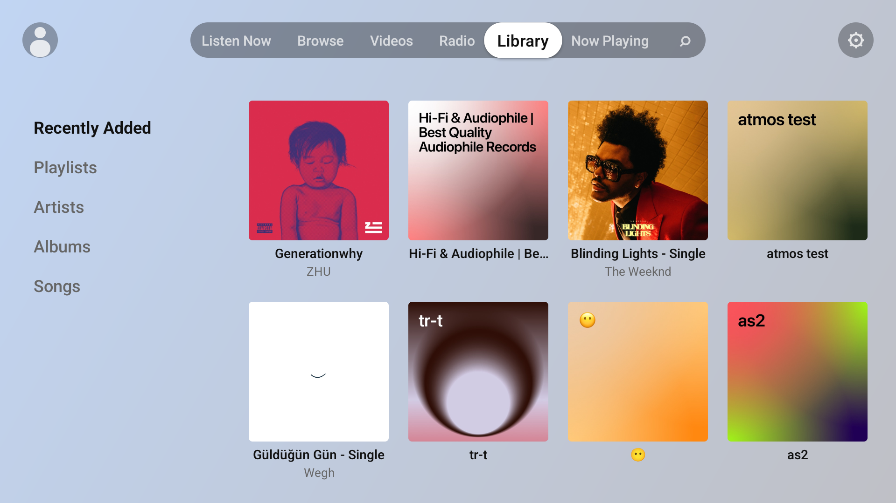
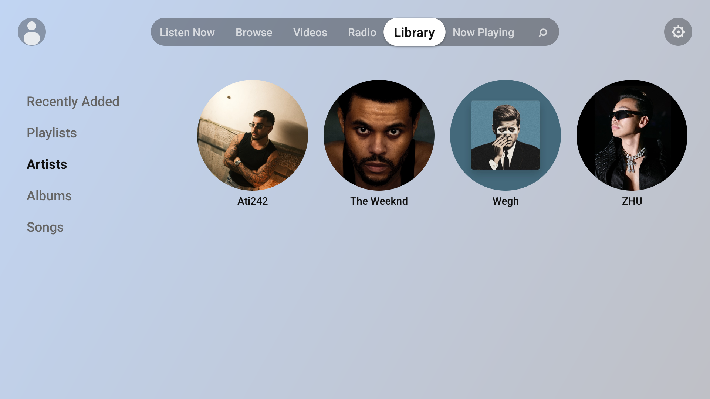
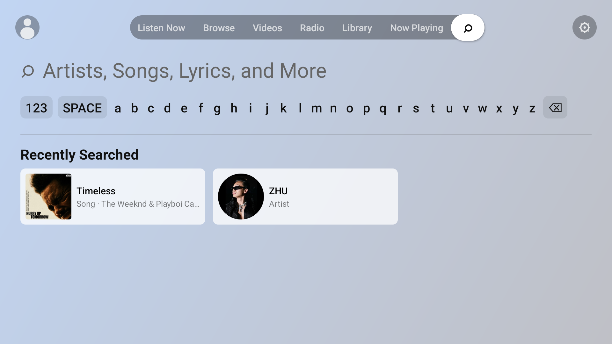

# 🎵 AirTune Music

  <b>An Apple Music client for Android TV</b> 
  Built with React Native

  
  
  
  

---

## ✨ Features

- **📺 Native TV Experience**: Fully optimized for D-pad navigation and remote control interaction.
- **💎 Native UI**: Modern native-like interface with dynamic background color extraction from artwork.
- **📱 TV Link Pairing**: Easy sign-in using your phone or PC via a local pairing server—no clunky TV keyboard required.
- **🎼 Full Library Access**: Browse your playlists, albums, and "Listen Now" recommendations.
- **📻 Apple Music Radio**: Stream your favorite stations and algorithmic radio.
- **🚀 Performance**: Built on `react-native-tvos` for smooth performance on hardware.

---

## 📸 Screenshots

  
  

  
  

---

## 🔗 Download

  

---

## 🛠 Technical Overview

| Area      | Technology                             |
| --------- | -------------------------------------- |
| Framework | React Native (`react-native-tvos`)     |
| Language  | TypeScript                             |
| API       | Apple Music API (REST)                 |
| Auth      | MusicKit JS (via Local Pairing Server) |

### Local Pairing Server (TV Link)

Because Android TV lacks a convenient keyboard, this app uses a dedicated **pairing flow**:

1. The TV app starts a **built-in local web server**.
2. User goes to the TV's IP (e.g., `http://192.168.1.50:8080/tv`) on a phone.
3. User signs in via Apple MusicKit JS on the mobile browser.
4. The token is sent back to the TV instantly.

---

## 🚀 Getting Started

### Prerequisites

- **Node.js**: >= 20.x
- **Yarn**: Recommended
- **Java**: Version 17 (for Android builds)
- **Apple Music Developer Token**: Required for API access.

### Installation

1. Clone the repository: `git clone https://github.com/alidogangullu/AirTuneMusic.git`
2. Install dependencies: `yarn install`
3. Configure environment: Copy `.env.example` to `.env.local` and add your `APPLE_MUSIC_DEVELOPER_TOKEN`.
4. Build for Android TV: `yarn android`

For detailed setup instructions, see:

- [🚀 Run & Debug Guide](docs/ANDROID_TV_RUN_DEBUG.md)
- [🔑 Developer Token Setup](docs/DEVELOPER_TOKEN_SETUP.md)
- [📂 Project Structure](docs/PROJECT_STRUCTURE.md)
